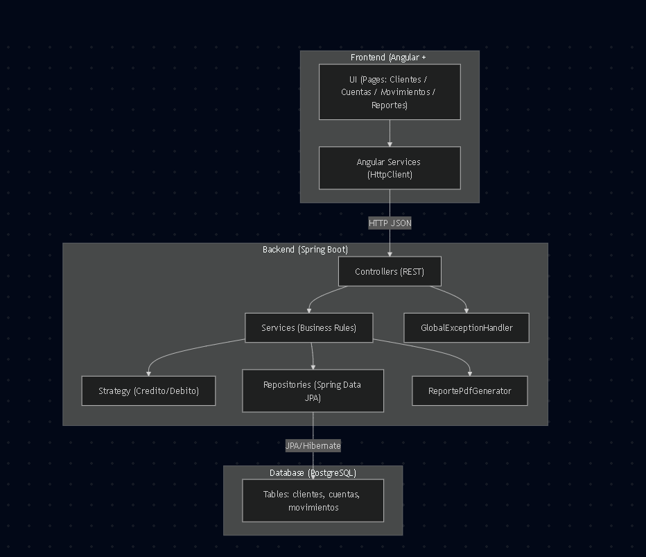

# Devsu Bank – Backend API (Java / Spring Boot)

API REST para la gestión de **Clientes**, **Cuentas** y **Movimientos**, con generación de **Reporte de Estado de Cuenta** en:

- **JSON**
- **PDF en Base64** (incluido en la respuesta)

El proyecto está **dockerizado** y utiliza **PostgreSQL** como base de datos.  
Forma parte de una **prueba técnica Full-Stack BP**.

---

## ✅ Tecnologías utilizadas

### Backend
- **Java 17**
- **Spring Boot 3.5.10**
    - Spring Web
    - Spring Data JPA (Hibernate)
    - Bean Validation (Jakarta Validation)
- **PostgreSQL 16**
- **Maven**
- **JUnit 5 + MockMvc** (tests unitarios de endpoints)
- **Docker & Docker Compose**
- - **Git/GitHub**

### Testing / Tools
- Postman (colección exportada)

### Frontend (alcance del desafío)
- **Angular + TypeScript**
- CSS / SCSS propio (sin frameworks de estilos ni componentes prefabricados)

---

## 🧱 Arquitectura y diseño

La solución sigue una **arquitectura por capas**, aplicando buenas prácticas y patrones de diseño.

### Capas
- **Controller**: expone los endpoints REST.
- **Service**: reglas de negocio y orquestación.
- **Repository**: acceso a datos mediante Spring Data JPA.
- **DTOs**: modelos de entrada y salida de la API.
- **Exception Handling**: manejo centralizado de errores.
- **Strategy Pattern**: cálculo de movimientos según tipo (Crédito / Débito).
- **Util**: generación de reportes PDF.

### Flujo general
Request → Controller → Service → Repository → PostgreSQL

Además:
- Validaciones con `@Valid`
- Excepciones de negocio mediante `BusinessException`
- Manejo global de errores con `GlobalExceptionHandler`
- Generación de PDF con `ReportePdfGenerator`

---

## 🖼️ Diagrama de Arquitectura

El siguiente diagrama muestra la interacción entre Frontend, Backend y Base de Datos:



> El diagrama se encuentra en la carpeta raíz `/diagramas`.

---

## 📂 Estructura del proyecto

```text
bank-backend/
├── src/
│   ├── main/
│   │   ├── java/com.devsu.bank/
│   │   │   ├── config/
│   │   │   ├── controller/
│   │   │   ├── dto/
│   │   │   ├── entity/
│   │   │   ├── exception/
│   │   │   ├── repository/
│   │   │   ├── service/
│   │   │   │   └── strategy/
│   │   │   │       ├── CreditoStrategy
│   │   │   │       ├── DebitoStrategy
│   │   │   │       └── MovimientoStrategy
│   │   │   └── util/
│   │   │       └── ReportePdfGenerator
│   │   └── resources/
│   │       └── application.properties
│   └── test/
│       └── java/com.devsu.bank.controller/
│           ├── ClienteControllerTest
│           └── MovimientoControllerTest
├── postman/
│   └── Devsu-Bank-API.postman_collection.json
├── diagramas/
│   └── arquitectura-backend.png
├── BaseDatos.sql
├── docker-compose.yml
├── Dockerfile
├── pom.xml
└── README.md
```

---

## 🚀 Ejecución con Docker

### Levantar servicios (sin perder data)
```bash
docker compose up -d --build
```

Ver logs del backend

```bash
docker compose logs -f bank-api
docker compose logs -f postgres
```

Detener servicios (sin borrar data)

```bash
docker compose down
```

## 📌 Endpoints disponibles

### 🧍 Clientes

| Método | Endpoint            | Descripción              |
|--------|---------------------|--------------------------|
| POST   | `/clientes`         | Crear cliente            |
| GET    | `/clientes/{id}`    | Obtener cliente por id   |
| PUT    | `/clientes/{id}`    | Actualizar cliente       |
| DELETE | `/clientes/{id}`    | Eliminar cliente         |

### 🏦 Cuentas

| Método | Endpoint             | Descripción                          |
|--------|----------------------|--------------------------------------|
| POST   | `/cuentas`           | Crear cuenta                         |
| GET    | `/cuentas/{id}`      | Obtener cuenta                       |
| PUT    | `/cuentas/{id}`      | Actualizar cuenta                    |
| DELETE | `/cuentas/{id}`      | Eliminar cuenta                      |

### 💳 Movimientos

| Método | Endpoint                | Descripción                                 |
|--------|-------------------------|---------------------------------------------|
| POST   | `/movimientos`          | Crear movimiento (Débito / Crédito)         |
| GET    | `/movimientos/{id}`     | Consultar movimiento                        |
| PUT    | `/movimientos/{id}`     | Editar movimiento                           |
| DELETE | `/movimientos/{id}`     | Eliminar movimiento                         |


## 📊 Reportes – Estado de Cuenta

### ✅ Opción A (Principal – cumple enunciado)
**Formato:** JSON + PDF (Base64)
```http
GET /reportes?clienteId={id}&fechaInicio=YYYY-MM-DD&fechaFin=YYYY-MM-DD
```
| Método | Endpoint     | Descripción                                     |
|--------|--------------|-------------------------------------------------|
| GET    | `/reportes`  | Genera el estado de cuenta por cliente y fechas |

#### Query Parameters

| Parámetro     | Tipo   | Requerido | Descripción                        |
|---------------|--------|-----------|------------------------------------|
| clienteId     | Long   | Sí        | Identificador del cliente          |
| fechaInicio   | String | Sí        | Fecha inicio (YYYY-MM-DD)          |
| fechaFin      | String | Sí        | Fecha fin (YYYY-MM-DD)             |

#### Ejemplo de request

```http
GET http://localhost:8080/reportes?clienteId=4&fechaInicio=2026-02-02&fechaFin=2026-02-02
```

Ejemplo de response

```json
{
"reporte": { ... },
"pdfBase64": "JVBERi0xLjQKJ..."
}
```

### ✅ Opción B (Solo JSON)

```http
GET /clientes/{clienteId}/reportes?fechaInicio=YYYY-MM-DD&fechaFin=YYYY-MM-DD
```

| Método | Endpoint                         | Descripción             |
| ------ | -------------------------------- | ----------------------- |
| GET    | `/clientes/{clienteId}/reportes` | Reporte en formato JSON |

Query Parameters:
- fechaInicio (YYYY-MM-DD)
- fechaFin (YYYY-MM-DD)

### ✅ Opción C (JSON + PDF Base64)

```http
GET /clientes/{clienteId}/reportes/pdf?fechaInicio=YYYY-MM-DD&fechaFin=YYYY-MM-DD
```
| Método | Endpoint                             | Descripción                     |
| ------ | ------------------------------------ | ------------------------------- |
| GET    | `/clientes/{clienteId}/reportes/pdf` | Reporte en JSON + PDF en Base64 |

Query Parameters:

- fechaInicio (YYYY-MM-DD)
- fechaFin (YYYY-MM-DD)

## 🧠 Reglas de negocio (Movimientos)

- Créditos → valores positivos 
- Débitos → valores negativos 
- Se persiste el saldo disponible por transacción 
- Si el débito excede el saldo → "Saldo no disponible"
- Límite diario configurable (BANK_LIMITE_DIARIO_RETIRO)
- Si se excede el cupo diario → "Cupo diario Excedido"

##  🧯 Manejo de errores

#### BusinessException — HTTP 400
```json
{
  "timestamp": "2026-02-02T15:20:00Z",
  "message": "Saldo no disponible"
}
```
#### Validaciones (@Valid) — HTTP 400
```json
{
  "timestamp": "2026-02-02T15:20:00Z",
  "message": "Validación inválida",
  "errors": {
    "campo": "detalle"
  }
}
```

#### JSON inválido — HTTP 400
```json
{
  "timestamp": "2026-02-02T15:20:00Z",
  "message": "JSON inválido"
}
```

## ✅ Tests
Ejecutar pruebas unitarias:
````bash
./mvnw test
````
Incluye pruebas de controladores usando MockMvc.

## 🧪 Postman Collection
La colección Postman para validar los endpoints se encuentra en:

````codigo
postman/Devsu-Bank-API.postman_collection.json
````
Incluye:
- CRUD Clientes 
- CRUD Cuentas 
- CRUD Movimientos 
- Reportes (JSON / PDF Base64)


## 🖥️ Frontend (Angular – Alcance Full-Stack

